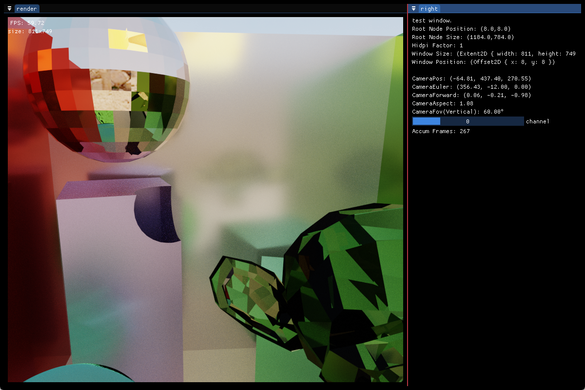
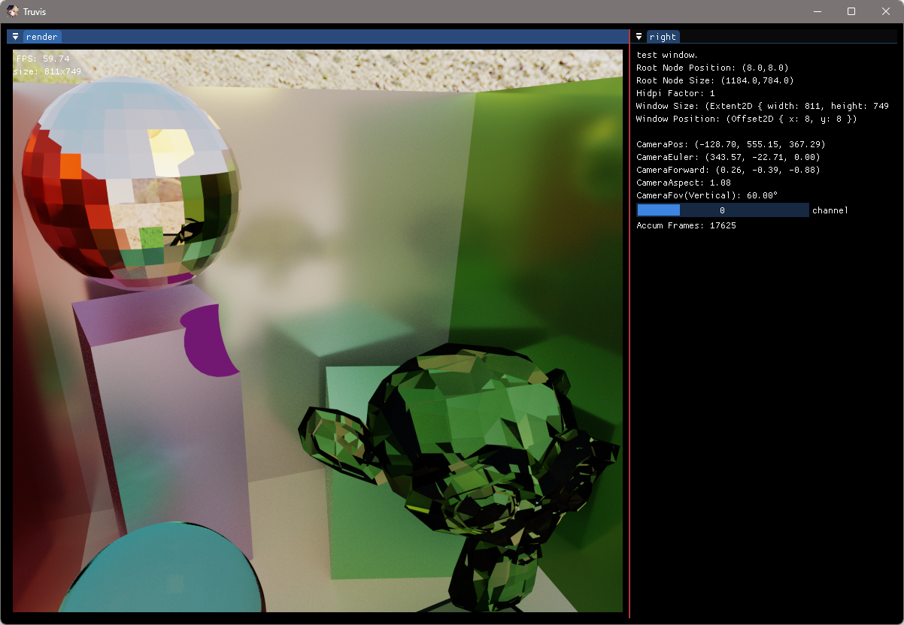

# Render-Rust-vk-Truvis

[](https://github.com/acccoco/Render-Rust-vk-Truvis)
[](https://github.com/acccoco/Render-Rust-vk-Truvis/actions)
[](https://deepwiki.com/acccoco/Render-Rust-vk-Truvis)

基于 Rust 和 Vulkan 的现代渲染引擎，支持自动化着色器绑定和光线追踪技术。


## 🌟 特性

- **光线追踪支持**: 硬件加速光线追踪，支持 Sponza 和 Cornell Box 场景
- **自动着色器绑定**: 基于 Slang 的自动 Rust 绑定生成系统
- **模块化架构**: 基于 Workspace 的清晰分层设计
- **跨平台支持**: Windows 平台完整支持，CMake + vcpkg 自动依赖管理
- **现代 Vulkan**: Vulkan 1.3+ RHI 抽象层
- **实时 GUI**: 集成 ImGui 调试界面
- **多格式模型**: 通过 Assimp 支持 FBX、glTF、OBJ 等格式
- **Bindless 渲染**: 现代 GPU 驱动的渲染管线

### 支持剖切体



### 支持填充面



## 🏗️ 项目结构

```
crates/
├── truvis-rhi/           # Vulkan RHI 抽象（设备、命令、内存管理）
├── truvis-render/        # 主渲染库和演示应用
│   └── src/bin/          # triangle/, rt-sponza/, rt_cornell.rs, shader_toy/
├── model-manager/        # 顶点数据和几何体管理
├── truvis-cxx/          # C++ 库绑定（Assimp + CMake）
├── shader-layout-*/     # 描述符布局宏和 trait
└── truvis-crate-tools/  # 工作区路径工具

shader/
├── src/                 # 按功能组织的 .slang/.glsl/.hlsl 源码
├── include/            # 共享头文件（.slangi）
├── shader-binding/     # 自动生成 Rust 绑定（bindgen）
└── shader-build/       # 着色器编译工具

assets/                  # 3D 模型和场景文件
resources/              # 纹理、字体等资源
tools/slang/           # Slang 编译器工具链
```

## 🚀 快速开始

### 环境要求

- **Rust**: 1.75+
- **Vulkan SDK**: 1.3+
- **CMake**: 3.20+
- **Visual Studio**: 2019+ (Windows)
- **vcpkg**: 自动通过 `vcpkg.json` 管理 C++ 依赖

### 构建流程

⚠️ **重要**: 必须按以下顺序执行构建步骤

1. **克隆仓库**
```powershell
git clone https://github.com/acccoco/Render-Rust-vk-Truvis.git
cd Render-Rust-vk-Truvis
```

2. **首次构建**（自动处理 CMake + C++ 依赖）
```powershell
cargo build --release
```

3. **编译着色器**（运行前必需！）
```powershell
cargo run --bin build_shader
```

4. **运行演示程序**
```powershell
# 基础三角形
cargo run --bin triangle

# 光线追踪 Sponza 场景
cargo run --bin rt-sponza

# Cornell Box 光线追踪
cargo run --bin rt_cornell

# 着色器实验场
cargo run --bin shader_toy
```

## 🎯 应用开发

### OuterApp 模式

所有应用都遵循标准的 `OuterApp` trait 模式：

```rust
use truvis_render::outer_app::OuterApp;

struct MyApp {
    pipeline: MyPipeline,
    geometry: DrsGeometry<VertexType>,
}

impl OuterApp for MyApp {
    fn init(renderer: &mut Renderer, camera: &mut DrsCamera) -> Self {
        Self {
            pipeline: MyPipeline::new(&renderer.rhi, &renderer.frame_settings()),
            geometry: VertexAosLayout::triangle(&renderer.rhi),
        }
    }
    
    fn draw(&self, pipeline_ctx: PipelineContext) {
        self.pipeline.render(pipeline_ctx, &self.geometry);
    }
    
    fn draw_ui(&mut self, ui: &imgui::Ui) { 
        // 可选 GUI 代码
    }
}

fn main() { 
    TruvisApp::<MyApp>::run(); 
}
```

### 着色器开发工作流

#### 1. Slang 结构体自动绑定

```rust
// shader/include/frame_data.slangi
struct PerFrameData {
    float4x4 projection;
    float4x4 view;
    float3 camera_pos;
    uint time_ms;
};

// 自动生成到 shader_binding crate
use shader_binding::PerFrameData;
```

#### 2. 描述符布局简化

```rust
#[shader_layout]  // 来自 shader-layout-macro
struct MyLayout {
    #[binding = 0] uniforms: PerFrameData,
    #[texture(binding = 1)] diffuse: TextureHandle,
    #[sampler(binding = 2)] sampler: SamplerHandle,
}
```

#### 3. 多编译器支持

- **Slang**: `.slang` → `slangc` (主要使用)
- **GLSL**: `.vert/.frag` → `glslc`  
- **HLSL**: `.hlsl` → `dxc`
- 输出: `shader/.build/*.spv` (SPIR-V)

## 📁 资源管理

### TruvisPath（统一路径管理）

```rust
use truvis_crate_tools::resource::TruvisPath;

// 所有路径基于工作区根目录
let model = TruvisPath::assets_path("sponza.fbx");           // assets/sponza.fbx
let texture = TruvisPath::resources_path("uv_checker.png");  // resources/uv_checker.png
let shader = TruvisPath::shader_path("rt/raygen.slang.spv"); // shader/.build/rt/raygen.slang.spv
```

### 顶点数据创建

```rust
use model_manager::vertex::vertex_pc::{VertexAosLayoutPosColor, VertexPosColor};

// 内置几何体
let triangle = VertexAosLayoutPosColor::triangle(&rhi);
let quad = VertexAosLayoutPosColor::quad(&rhi);

// 通过 truvis-cxx + Assimp 加载模型
// DLL 自动复制到 target/ 目录
```

## 🎮 运行时控制

- **WASD**: 相机移动
- **鼠标**: 相机旋转  
- **Shift**: 加速移动
- **F**: 切换 GUI 显示

## 📐 坐标系统（严格遵循）

- **模型/世界**: 右手，Y-Up
- **视图**: 右手，Y-Up，相机朝向 -Z
- **NDC**: 左手，Y-Up  
- **帧缓冲**: 原点左上角，视口 `height < 0`
- 三角形绕序：CCW，符合右手定则


### Blender 导出设置

Blender 导出为 FBX 时需要指定：
- **Forward**: Y
- **Up**: Z

这样可以与 Renderer 的坐标系统正确对齐。

## ⚠️ 重要限制

### 构建依赖顺序

```powershell
# ❌ 错误：直接运行会失败，因为着色器未编译
cargo run --bin triangle

# ✅ 正确：必须先编译着色器
cargo run --bin build_shader
cargo run --bin triangle
```

### 常见陷阱

```rust
// ❌ 错误：忘记使用 TruvisPath
let shader = "shader/src/triangle/triangle.slang.spv";

// ✅ 正确：使用 TruvisPath 获取正确路径
let shader = TruvisPath::shader_path("hello_triangle/triangle.slang.spv");

// ❌ 错误：viewport 设置错误
let viewport = vk::Viewport { height: extent.height as f32, .. };

// ✅ 正确：Y轴翻转 (height < 0)
let viewport = vk::Viewport { 
    y: extent.height as f32,
    height: -(extent.height as f32),
    ..
};
```

## �️ 开发任务模板

### 添加新应用

```powershell
# 1. 创建目录
mkdir crates/truvis-render/src/bin/my_app/

# 2. 实现 main.rs（参考 OuterApp 模式）
# 3. 如需新着色器，在 shader/src/ 添加 .slang 文件
# 4. 运行构建流程
cargo run --bin build_shader
cargo run --bin my_app
```

### 创建新渲染管线

```rust
// crates/truvis-render/src/render_pipeline/my_pass.rs
pub struct MyPass {
    pipeline: GraphicsPipeline,
    descriptor_sets: Vec<DescriptorSet>,
}

// crates/truvis-render/src/render_pipeline/my_pipeline.rs  
impl MyPipeline {
    pub fn render(&self, ctx: PipelineContext, geometry: &DrsGeometry<T>) {
        // ctx.command_buffer 记录命令
    }
}
```

### 添加新着色器

```powershell
# 1. 在 shader/src/ 创建 .slang 文件
# 2. 如需共享结构体，添加到 shader/include/*.slangi
# 3. 重新编译着色器
cargo run --bin build_shader
# 4. 使用自动生成的绑定
```

```rust
use shader_binding::MyStruct;
```

## 🔧 故障排除

### 编译失败常见原因

1. **Slang 编译器缺失**: 确保 `tools/slang/slangc.exe` 存在
2. **CMake 失败**: 检查 `VCPKG_ROOT` 环境变量
3. **DLL 缺失**: 运行 `cargo build` 触发 DLL 复制

### 运行时问题

```rust
// ✅ 正确的 PipelineContext 使用模式
impl OuterApp for MyApp {
    fn draw(&self, ctx: PipelineContext) {
        let cmd = ctx.cmd_allocator.alloc_command_buffer("my-pass");
        // ❌ 避免：不要缓存 ctx 的组件引用
    }
}
```

## 🎯 架构特色

### 自动化系统

- **着色器绑定**: `shader-binding/build.rs` 从 `.slangi` 头文件生成 Rust 结构体
- **C++ 集成**: `truvis-cxx/build.rs` 通过 CMake 构建 Assimp，自动复制 DLL
- **并行编译**: `shader-build` 使用 `rayon::par_bridge()` 并行编译着色器

### 设计原则

- **性能优先**: Vulkan 1.3+ 低级 API，Bindless 渲染管线
- **内存安全**: Rust 零成本抽象 + Vulkan 验证层
- **模块化**: Workspace 松耦合设计，便于扩展
- **开发效率**: 自动绑定生成，简化常见操作

### 调试支持

- **命名规范**: Object name 格式 `[frame-A-id][pass]name`
- **着色器调试**: 支持 `-g2` 标志，Nsight Graphics 兼容
- **Vulkan 层**: 运行时可配置验证层和调试选项

## 📚 核心依赖

### Rust 生态

- **ash**: Vulkan API 绑定
- **winit**: 跨平台窗口创建  
- **glam**: 高性能数学库
- **vk-mem**: Vulkan 内存分配器
- **imgui**: 即时模式 GUI
- **rayon**: 数据并行处理

### C++ 集成

- **Assimp**: 3D 模型加载（通过 `truvis-cxx`）
- **CMake**: 自动构建系统
- **vcpkg**: 依赖管理（`vcpkg.json`）

### 着色器工具链

- **Slang**: 现代着色器语言和编译器
- **bindgen**: 自动 FFI 绑定生成
- **glslc/dxc**: 备用编译器支持

## � 当前状态

### 活跃开发

项目正在进行 `Renderer` 结构体重构（参考 `REFACTOR_PLAN.md`），目标是优化架构设计：

```rust
// 目标架构（重构中）
pub struct Renderer {
    pub core: RenderCore,           // 设备、帧控制、命令
    pub resources: RenderResources, // 资源、bindless、缓冲区  
    pub scene: SceneContext,        // 场景、GPU数据
    pub settings: RenderSettings,   // 统一配置
}
```

### 高优先级修复

来自 `TODO.md` 的关键问题：

1. **ImGui 事件处理**: `truvis-render/src/app.rs:236` - 影响用户交互
2. **光照衰减计算**: `shader/include/light.slangi:29` - 影响渲染质量  
3. **用户事件处理**: `truvis-render/src/app.rs:227` - 功能缺失

### 规划功能

- 聚光灯支持
- Hit Group 多样化
- 性能优化（编译时间和运行时）

## 🤝 贡献指南

### 开发注意事项

- **重构期间**: 优先修复现有问题，避免大的架构变更
- **新功能**: 参考 `OuterApp` 模式和现有演示应用
- **性能**: 关注编译时间和运行时 `RefCell` 借用检查开销

### 提交规范

1. 确保通过 `cargo run --bin build_shader`
2. 测试至少一个演示应用
3. 遵循现有的命名和架构约定
4. 更新相关文档

## �🔗 相关链接

- [Vulkan 规范](https://www.vulkan.org/)
- [Slang 着色器语言](https://github.com/shader-slang/slang)
- [Rust GPU 编程](https://sotrh.github.io/learn-wgpu/)
- [项目重构计划](./REFACTOR_PLAN.md)
- [TODO 列表](./TODO.md)
