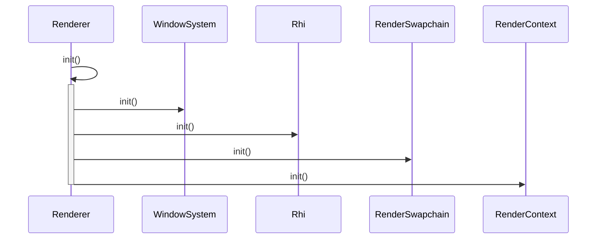

TODO

- [ ] 使用新版的 `ash` 配合 `vk-mem`
- [ ] 使用 `hlsl` 而不是 `glsl`
- [ ] 完善窗口系统，以及 `imgui`
- [ ] (optional)在 app 内配置 `vulkan` 的各种 `layer` 参数

初始化流程：

```mermaid
sequenceDiagram
    participant R as Renderer
    participant W as WindowSystem
    participant Rhi
    participant RS as RenderSwapchain
    participant RC as RenderContext
    R ->> R: init()
    activate R
    R ->> W: init()
    R ->> Rhi: init()
    R ->> RS: init()
    R ->> RC: init()
    deactivate R
```
