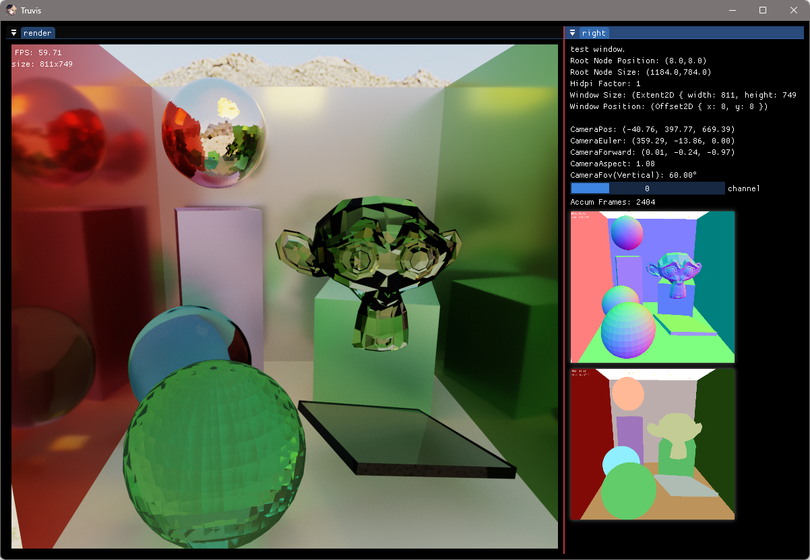

# Render-Rust-vk-Truvis

[](https://github.com/acccoco/Render-Rust-vk-Truvis)
[](https://github.com/acccoco/Render-Rust-vk-Truvis/actions)
[](https://deepwiki.com/acccoco/Render-Rust-vk-Truvis)

一个基于 Rust 和 Vulkan 的现代图形渲染引擎，支持光栅化和光线追踪渲染管线。



## 🌟 特性

- **多渲染管线**: 支持光栅化和光线追踪渲染管线
- **Shader 自动绑定**: 使用 Slang 着色器语言，自动生成 Rust 绑定
- **多平台窗口系统**: 基于 winit 的跨平台窗口管理
- **ImGui 集成**: 内置 ImGui 支持，便于调试和工具开发
- **场景管理**: 支持多种 3D 模型格式加载（FBX、glTF、OBJ 等）
- **Vulkan 抽象**: 提供易用的 Vulkan API 封装
- **模块化设计**: 基于 Rust workspace 的模块化架构

## 🏗️ 项目结构

```
├── assets/                     # 资源文件
├── crates/                     # 核心库
│   ├── truvis-rhi/            # Vulkan RHI 层
│   ├── model-manager/         # 场景和模型管理
│   ├── truvis-cxx/            # C++ 库绑定（Assimp）
│   ├── shader-layout-*        # Shader 布局宏和 trait
│   └── truvis-crate-tools/    # 共享工具
├── shader/                     # Shader 代码
│   ├── src/                   # Shader 源码
│   ├── include/               # Shader 头文件
│   ├── shader-binding/        # Shader-Rust 绑定
│   └── shader-build/          # Shader 构建工具
├── truvis-render/             # 主渲染库
│   └── src/bin/               # 示例程序
└── tools/                     # 开发工具
```

## 🚀 快速开始

### 环境要求

- Rust 1.75+
- Vulkan SDK 1.3+
- CMake 3.20+
- Visual Studio 2019+ (Windows)

### 构建

1. 克隆仓库

```bash
git clone https://github.com/acccoco/Render-Rust-vk-Truvis.git
cd Render-Rust-vk-Truvis
```

2. 构建项目

```bash
cargo build --release
```

3. 编译 Shader

```bash
cargo run --bin build_shader
```

### 运行示例

#### 基础三角形

```bash
cargo run --bin triangle
```

#### 光线追踪 - Sponza 场景

```bash
cargo run --bin rt-sponza
```

#### Cornell Box 光线追踪

```bash
cargo run --bin rt_cornell
```

#### Shader Toy

```bash
cargo run --bin shader_toy
```

## 📦 核心模块

### truvis-rhi

Vulkan 渲染硬件接口（RHI）层，提供：

- 设备和队列管理
- 内存分配器封装
- 命令缓冲区抽象
- 管线状态对象
- 同步原语

### truvis-render

主渲染库，包含：

- 渲染器核心
- 场景管理
- 相机系统
- GUI 系统
- 渲染管线

### shader-binding

着色器绑定系统，支持：

- Slang 着色器语言
- 自动生成 Rust 绑定
- 描述符布局管理

### model-manager

场景和模型管理，支持：

- 多种 3D 模型格式
- 材质系统
- 几何体管理
- 顶点布局

## 🎮 控制说明

- **WASD**: 相机移动
- **鼠标**: 相机旋转
- **Shift**: 加速移动
- **F**: 显示/隐藏 GUI

## 🛠️ 开发指南

### 添加新的渲染管线

1. 在 `truvis-render/src/render_pipeline/` 下创建新模块
2. 实现 `RenderPipeline` trait
3. 在 `truvis-render/src/bin/` 下创建示例程序

### 添加新的 Shader

1. 在 `shader/src/` 下创建 shader 文件
2. 使用 Slang 语法编写
3. 运行 `cargo run --bin build_shader` 编译

### 自定义应用

实现 `OuterApp` trait：

```rust
use truvis_render::outer_app::OuterApp;

struct MyApp;

impl OuterApp for MyApp {
    fn init(renderer: &mut Renderer, camera: &mut DrsCamera) -> Self {
        // 初始化代码
        Self
    }

    fn draw_ui(&mut self, ui: &Ui) {
        // GUI 代码
    }

    fn draw(&self, pipeline_ctx: PipelineContext) {
        // 渲染代码
    }
}

fn main() {
    TruvisApp::<MyApp>::run();
}
```

## 🎯 设计原则

- **性能优先**: 使用 Vulkan 低级 API，充分利用硬件性能
- **安全性**: 借助 Rust 的内存安全保证
- **模块化**: 松耦合的模块设计，便于扩展
- **易用性**: 提供高级抽象，简化常见操作

## 📐 坐标系统

- **模型空间**: 右手坐标系，Y-Up
- **世界空间**: 右手坐标系，Y-Up
- **观察空间**: 右手坐标系，Y-Up，相机朝向 -Z
- **NDC**: 左手坐标系，Y-Up
- **帧缓冲**: 原点在左上角
- **视口**: 确保 `height < 0`


注：背面剔除的时机：基于 framebuffer 中的三角形的顶点顺序。

已知 Blender 的坐标系是：Right-Handed, Z-Up

Blender 导出为 fbx 的方法：需要指定 Forward = Y，Up = Z，就可以和 Renderer 对齐了。

## 🔧 配置选项

### Debug 命名规范

- Object name: `[frame-A-id][pass]name`
- Queue/Command label: `[frame-A-id][pass]name`

### Vulkan 层配置

项目支持在运行时配置 Vulkan 验证层和调试选项。

## 📚 依赖库

### 核心依赖

- **ash**: Vulkan API 绑定
- **winit**: 跨平台窗口创建
- **glam**: 数学库
- **vk-mem**: Vulkan 内存分配器

### 资源加载

- **image**: 图像处理
- **gltf**: glTF 模型加载
- **tobj**: OBJ 模型加载

### UI 和工具

- **imgui**: 即时模式 GUI
- **log**: 日志系统
- **chrono**: 时间处理

## 🔗 相关链接

- [Vulkan 文档](https://www.vulkan.org/)
- [Slang 着色器语言](https://github.com/shader-slang/slang)
- [Rust 图形编程](https://sotrh.github.io/learn-wgpu/)
