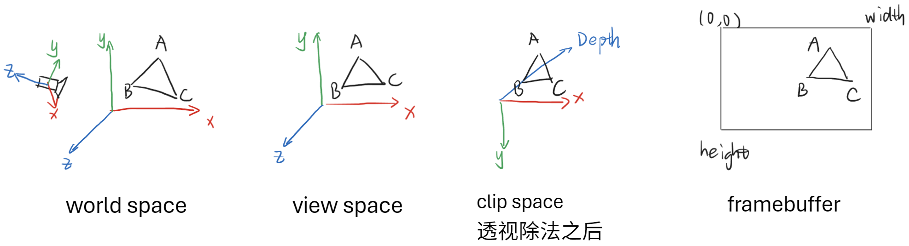

[](https://github.com/acccoco/Render-Rust-vk-Truvis)
[](https://github.com/acccoco/Render-Rust-vk-Truvis/actions)

TODO

- [ ] 多种材质系统，多种渲染流程(forward, deferred, etc)
- [ ] 使用 `hlsl` 而不是 `glsl`
- [x] 完善窗口系统，以及 `imgui`
    - [ ] `imgui` 支持图片 Texture
    - [ ] `winit` 注册事件回调，而不是主动调用 `render_loop()`
- [x] (optional)在 app 内配置 `vulkan` 的各种 `layer` 参数
- [x] 不要 static，减少函数理解的心智负担
- [x] 不要 option，减少调用开销。

`Texture` 的实现思路：`texture` 应该包含如下内容：

* `image`
* `image view`
* `descriptor image info`
* `sampler`

# Debug 命名规范

* object name：`[frame-A-id][pass]name`
* queue label/cmd label：`[frame-A-id][pass]name`

# 坐标系

* world: Right-Handed, Y-Up
* camera: 右手，Y-Up。相机朝向 -Z
* clip：x 和相机保持一直，y 和相机相反（朝下）
* framebuffer：顶点在左上角。深度 0-1，0 在最远处，1 在最近处



注：背面剔除的时机：基于 framebuffer 中的三角形的顶点顺序。

已知 Blender 的坐标系是：Right-Handed, Z-Up

从当前应用到 Blender，需要：

```shell  
x_blender = x
y_blender = -z
z_blender = y
```