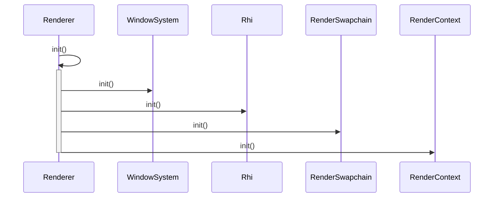

TODO

- [ ] 1.使用新版的 ash 配合 vk-mem

初始化流程：

```mermaid
sequenceDiagram
    participant R as Renderer
    participant W as WindowSystem
    participant Rhi
    participant RS as RenderSwapchain
    participant RC as RenderContext

    R->>R: init()
    activate R
        R->>W: init()
        R->>Rhi: init()
        R->>RS: init()
        R->>RC: init()
    deactivate R
```
