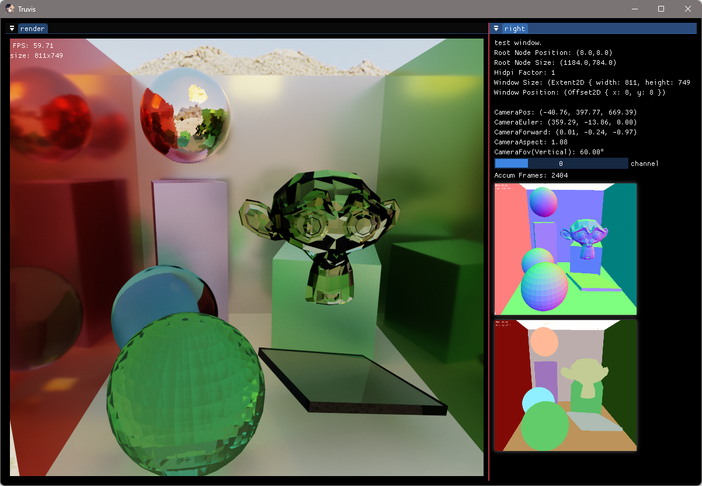
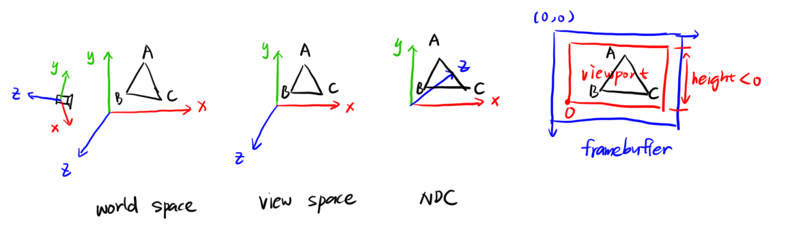

# Render-Rust-vk-Truvis

[](https://github.com/acccoco/Render-Rust-vk-Truvis)
[](https://github.com/acccoco/Render-Rust-vk-Truvis/actions)
[](https://deepwiki.com/acccoco/Render-Rust-vk-Truvis)

基于 Rust 和 Vulkan 的现代渲染引擎，支持自动化着色器绑定和光线追踪技术。



## 🌟 特性

- **光线追踪支持**: 硬件加速光线追踪，支持 Sponza 和 Cornell Box 场景
- **自动着色器绑定**: 基于 Slang 的自动 Rust 绑定生成系统
- **模块化架构**: 基于 Workspace 的清晰分层设计
- **跨平台支持**: Windows 平台完整支持，CMake + vcpkg 自动依赖管理
- **现代 Vulkan**: Vulkan 1.3+ RHI 抽象层
- **实时 GUI**: 集成 ImGui 调试界面
- **多格式模型**: 通过 Assimp 支持 FBX、glTF、OBJ 等格式
- **Bindless 渲染**: 现代 GPU 驱动的渲染管线

### 支持剖切体


### 支持填充面


## 🏗️ 项目结构

```
crates/
├── truvis-rhi/           # Vulkan RHI 抽象（设备、命令、内存管理）
├── truvis-render/        # 主渲染库和演示应用
│   └── src/bin/          # triangle/, rt-sponza/, rt_cornell.rs, shader_toy/
├── model-manager/        # 顶点数据和几何体管理
├── truvis-cxx/          # C++ 库绑定（Assimp + CMake）
├── shader-layout-*/     # 描述符布局宏和 trait
└── truvis-crate-tools/  # 工作区路径工具

shader/
├── src/                 # 按功能组织的 .slang/.glsl/.hlsl 源码
├── include/            # 共享头文件（.slangi）
├── shader-binding/     # 自动生成 Rust 绑定（bindgen）
└── shader-build/       # 着色器编译工具

assets/                  # 3D 模型和场景文件
resources/              # 纹理、字体等资源
tools/slang/           # Slang 编译器工具链
```

## 🚀 快速开始

### 环境要求

- **Rust**: 1.75+
- **Vulkan SDK**: 1.3+
- **CMake**: 3.20+
- **Visual Studio**: 2019+ (Windows)
- **vcpkg**: 自动通过 `vcpkg.json` 管理 C++ 依赖

### 构建流程

⚠️ **重要**: 必须按以下顺序执行构建步骤

**克隆仓库**

```powershell
git clone https://github.com/acccoco/Render-Rust-vk-Truvis.git
cd Render-Rust-vk-Truvis
```

**首次构建**（自动处理 CMake + C++ 依赖）

```powershell
cargo build --release
```

**编译着色器**（运行前必需！）

```powershell
cargo run --bin build_shader
```

**运行演示程序**

```powershell
# 基础三角形
cargo run --bin triangle

# 光线追踪 Sponza 场景
cargo run --bin rt-sponza

# Cornell Box 光线追踪
cargo run --bin rt_cornell

# 着色器实验场
cargo run --bin shader_toy
```

## 🎯 应用开发

### 着色器开发工作流

#### 1. Slang 结构体自动绑定

```cpp
// shader/include/frame_data.slangi
struct PerFrameData {
    float4x4 projection;
    float4x4 view;
    float3 camera_pos;
    uint time_ms;
};

// 自动生成到 shader_binding crate
use shader_binding::PerFrameData;
```

#### 2. 描述符布局简化

```rust
#[shader_layout]  // 来自 shader-layout-macro
struct MyLayout {
    #[binding = 0] uniforms: PerFrameData,
    #[texture(binding = 1)] diffuse: TextureHandle,
    #[sampler(binding = 2)] sampler: SamplerHandle,
}
```

## 坐标系和单位制

坐标系统：

- **Model/World**: Right Hand，X-Right, Y-Up
- **View**: Right Hand，Y-Up，相机朝向 -Z
- **NDC**: 左手，Y-Up
- **FrameBuffer**: 原点左上角，视口 `height < 0`
- 三角形绕序：FrontFace = CCW，符合右手定则



单位制：Meter

### 矩阵

应用内

- 矩阵的存储：列主序
- 向量：列向量
- 矩阵乘法：右乘

```
v' = M * v
M = T * R * S
```

shader

- 矩阵的存储：行主序
- 向量：行向量
- 矩阵乘法：左乘
- 这是在编译 shader 时指定的

### Blender 导出设置

Blender 坐标系: RightHand, Z-Up, Y-Forward

Unity 坐标系: LeftHand, Y-Up, Z-Forward

UE 坐标系: LeftHand, Z-Up, X-Forward

Assimp 坐标系: RightHand, Y-Up, X-Right

Blender 导出为 FBX 时，应该将自身坐标系的元数据写入，即：

- **Forward**: Y
- **Up**: Z

Assimp 在读取时，会去 fbx 里面读取坐标系配置的元数据，再转换为自身的坐标系

- Assmip 并不会对 mesh 数据进行变换，原封不动的读取出来
- Assimp 会在 node 的 transform 上应用坐标系变换，使得最后呈现出的 mesh 正确
- 比如，会使用负的 scale
