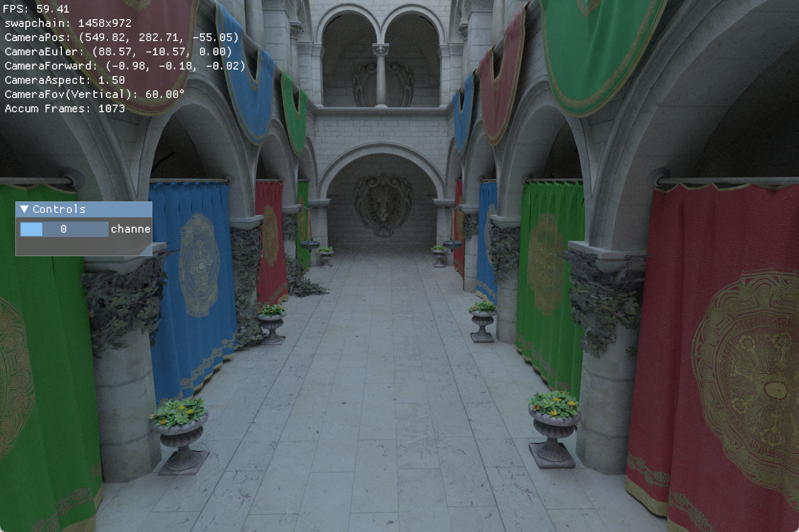
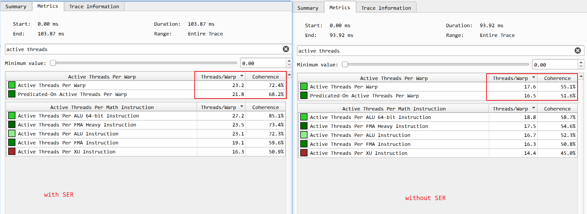

# TruvisRenderer.git

[](https://github.com/acccoco/TruvisRenderer/actions)
[](https://deepwiki.com/acccoco/TruvisRenderer)

基于 Rust 和 Vulkan 的现代渲染引擎，支持自动化着色器绑定和光线追踪技术。




## Quick Start

### 环境要求

- **Rust**: 1.75+
- **Vulkan SDK**: 1.3+
- **CMake**: 3.20+
- **Visual Studio**: 2019+ (Windows)
- **vcpkg**: 自动通过 `vcpkg.json` 管理 C++ 依赖

### 构建流程

**克隆仓库**

```powershell
git clone https://github.com/acccoco/Render-Rust-vk-Truvis.git
cd Render-Rust-vk-Truvis
```

**拉取资源和工具**

```powershell
cargo run --bin fetch_res
```

**构建 c++ 模块**

```powershell
cargo run --bin cxx-build
```

**编译 shader**

```powershell
cargo run --bin shader-build
```

**项目构建**

```powershell
cargo build --all
```

**运行演示程序**

```powershell
# 基础三角形
cargo run --bin triangle

# 光线追踪 Sponza 场景
cargo run --bin rt-sponza

# Cornell Box 光线追踪
cargo run --bin rt-cornell

# 着色器实验场
cargo run --bin shader-toy
```

## 🌟 特性

- **光线追踪支持**: 硬件加速光线追踪，支持 Sponza 和 Cornell Box 场景
- **自动着色器绑定**: 基于 Slang 的自动 Rust 绑定生成系统
- **模块化架构**: 基于 Workspace 的清晰分层设计
- **跨平台支持**: Windows 平台完整支持，CMake + vcpkg 自动依赖管理
- **现代 Vulkan**: Vulkan 1.3+ RHI 抽象层
- **实时 GUI**: 集成 ImGui 调试界面
- **多格式模型**: 通过 Assimp 支持 FBX、glTF、OBJ 等格式
- **Bindless 渲染**: 现代 GPU 驱动的渲染管线

### 剖切体和填充面

**剖切效果**


**填充面效果**


### 使用 SER 增加 threads coherence

在 tlas 求交后，使用 Shader Execution Reordering (SER)，基于 material 的类型进行重排序，
以提升后续 shading 阶段的线程局部性和缓存命中率，从而提高整体渲染性能。



### DescriptorSet 声明式绑定

bindless 的示例：

```rust
#[derive(DescriptorBinding)]
pub struct BindlessDescriptorBinding {
    #[binding = 0]
    #[descriptor_type = "COMBINED_IMAGE_SAMPLER"]
    #[stage = "FRAGMENT | RAYGEN_KHR | CLOSEST_HIT_KHR | ANY_HIT_KHR | CALLABLE_KHR | MISS_KHR | COMPUTE"]
    #[count = 128]
    #[flags = "PARTIALLY_BOUND | UPDATE_AFTER_BIND"]
    _textures: (),

    #[binding = 1]
    #[descriptor_type = "STORAGE_IMAGE"]
    #[stage = "FRAGMENT | RAYGEN_KHR | CLOSEST_HIT_KHR | ANY_HIT_KHR | CALLABLE_KHR | MISS_KHR | COMPUTE"]
    #[count = 128]
    #[flags = "PARTIALLY_BOUND | UPDATE_AFTER_BIND"]
    _uavs: (),

    #[binding = 2]
    #[descriptor_type = "SAMPLED_IMAGE"]
    #[stage = "FRAGMENT | RAYGEN_KHR | CLOSEST_HIT_KHR | ANY_HIT_KHR | CALLABLE_KHR | MISS_KHR | COMPUTE"]
    #[count = 128]
    #[flags = "PARTIALLY_BOUND | UPDATE_AFTER_BIND"]
    _srvs: (),
}
```

### RenderGraph

```rust
fn prepare_render_graph() {
    let mut graph = RenderGraphBuilder::new();
    graph.signal_semaphore(RgSemaphoreInfo::timeline(
        fence.handle(),
        vk::PipelineStageFlags2::BOTTOM_OF_PIPE,
        frame_id,
    ));

    // import external resource
    let swapchain_image_rg_handle = graph.import_image(
        "swapchain-image",
        swapchain_image_handle,
        Some(swapchain_view_handle),
        render_present.swapchain_image_info().image_format,
        RgImageState::UNDEFINED_BOTTOM,
        Some(RgSemaphoreInfo::binary(
            render_present.current_present_complete_semaphore(frame_label).handle(),
            vk::PipelineStageFlags2::COLOR_ATTACHMENT_OUTPUT,
        )),
    );

    // export external resource
    graph.export_image(
        swapchain_image_rg_handle,
        RgImageState::PRESENT_BOTTOM,
        Some(RgSemaphoreInfo::binary(
            render_present.current_render_compute_semaphore().handle(),
            vk::PipelineStageFlags2::BOTTOM_OF_PIPE,
        )),
    );

    // add passes
    graph
        .add_pass_lambda(
            "shader-toy",
            |builder| {
                builder.read_write_image(swapchain_image_rg_handle, RgImageState::COLOR_ATTACHMENT_READ_WRITE);
            },
            |context| {
                let canvas_view = context.get_image_view(swapchain_image_rg_handle).unwrap();
                self.shader_toy_pass.as_ref().unwrap().draw(
                    &renderer.render_context,
                    context.cmd,
                    canvas_view,
                    render_present.swapchain_image_info().image_extent,
                );
            },
        )
        .add_pass(
            "gui",
            GuiRgPass {
                gui_pass: self.gui_pass.as_ref().unwrap(),
                render_context: &renderer.render_context,

                ui_draw_data: gui_draw_data,
                gui_mesh: &render_present.gui_backend.gui_meshes[*frame_label],
                tex_map: &render_present.gui_backend.tex_map,

                canvas_color: swapchain_image_rg_handle,
                canvas_extent: render_present.swapchain_image_info().image_extent,
            },
        );
}
```

## 开发约定

坐标系统：

- **Model/World**: Right Hand，X-Right, Y-Up
- **View**: Right Hand，Y-Up，相机朝向 -Z
- **NDC**: 左手，Y-Up
- **FrameBuffer**: 原点左上角，视口 `height < 0`
- 三角形绕序：FrontFace = CCW，符合右手定则


单位制：Meter

### 矩阵

应用内

- 矩阵的存储：列主序
- 向量：列向量
- 矩阵乘法：右乘

```
v' = M * v
M = T * R * S
```

shader

- 矩阵的存储：行主序
- 向量：行向量
- 矩阵乘法：左乘
- 这是在编译 shader 时指定的

### Blender 导出设置

Blender 坐标系: RightHand, Z-Up, Y-Forward

Unity 坐标系: LeftHand, Y-Up, Z-Forward

UE 坐标系: LeftHand, Z-Up, X-Forward

Assimp 坐标系: RightHand, Y-Up, X-Right

Blender 导出为 FBX 时，应该将自身坐标系的元数据写入，即：

- **Forward**: Y
- **Up**: Z

Assimp 在读取时，会去 fbx 里面读取坐标系配置的元数据，再转换为自身的坐标系

- Assmip 并不会对 mesh 数据进行变换，原封不动的读取出来
- Assimp 会在 node 的 transform 上应用坐标系变换，使得最后呈现出的 mesh 正确
- 比如，会使用负的 scale
