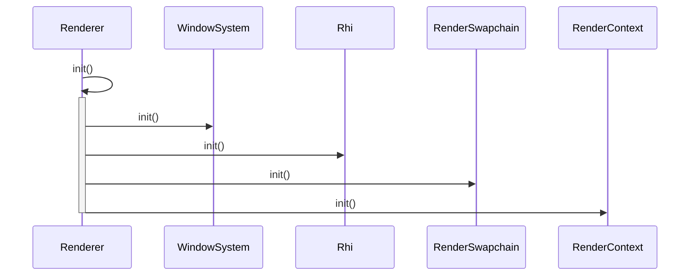

TODO

- [ ] 使用新版的 `ash` 配合 `vk-mem`
- [ ] 多种材质系统，多种渲染流程(forward, deferred, etc)
- [ ] 使用 `hlsl` 而不是 `glsl`
- [ ] 完善窗口系统，以及 `imgui`
- [ ] (optional)在 app 内配置 `vulkan` 的各种 `layer` 参数
- [ ] 不要 static，减少函数理解的心智负担
- [ ] 不要 option，减少调用开销。

初始化流程：

