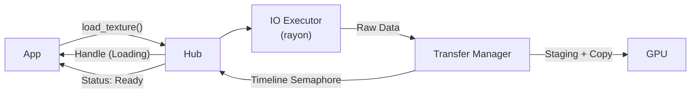

# 异步资源加载系统 (truvis-asset)

## 概述

解决同步加载资源导致的**启动阻塞**、**运行时卡顿**和**硬件利用率低**问题。

**设计目标**：磁盘 IO、解码、GPU 上传全流程后台执行；利用 Transfer Queue 进行 DMA 传输；基于 SlotMap 句柄安全管理生命周期；提供 Fallback 资源保证渲染不中断。

---

## 架构



### 模块职责

| 模块 | 职责 |
|:---|:---|
| **AssetHub** | 统一接口、状态管理、生命周期控制 |
| **AssetHandle** | 句柄系统，解耦引用与数据 |
| **AssetLoader** | 文件读取、格式解析、纹理解码 |
| **AssetUploadManager** | Staging Buffer、传输命令、GPU 同步 |

---

## 核心机制

### 句柄与状态机

使用 `slotmap` 实现 O(1) 查找，防止 ABA 问题。资源状态：
- `Loading` → IO/解码中
- `Uploading` → 已提交 Transfer Queue
- `Ready` → GPU 可用
- `Failed` → 加载失败

### GPU 传输同步

- 使用 **Timeline Semaphore** 追踪上传进度
- 每次 Submit 时 Signal 递增值，主线程轮询 `vkGetSemaphoreCounterValue`
- 完成后回收 Staging Buffer，标记资源 Ready

### Fallback 机制

资源未就绪时返回默认占位（1x1 粉色纹理），保证渲染管线不中断。

### 资源缓存

`HashMap<PathBuf, Handle>` 避免重复加载同一文件。

---

## 加载流程

1. **请求** - `hub.load_texture(path)` 立即返回 Handle，状态设为 Loading
2. **IO** - Worker 线程读取文件、解码为 RGBA8
3. **上传** - TransferManager 写入 Staging Buffer，录制 Copy 命令并提交
4. **完成** - 轮询 Semaphore，回收资源，状态更新为 Ready

---

## 使用示例

```rust
fn update(&mut self, renderer: &mut Renderer) {
    self.asset_hub.update();  // 驱动状态机
    
    // 获取纹理（未就绪时返回 Fallback）
    let tex = self.asset_hub.get_texture(self.my_texture);
}
```
