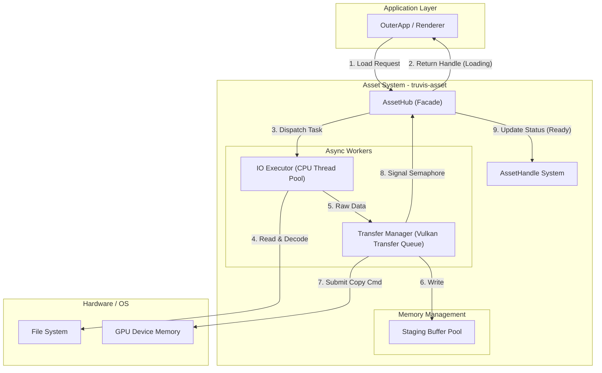

# 异步资源加载系统设计文档 (Async Asset Loading System)

## 1. 系统概述 (System Overview)

### 1.1 背景与痛点
当前的渲染引擎采用同步方式加载资源（纹理、模型），导致以下核心问题：
*   **启动阻塞 (Startup Blocking)**: 应用启动时必须等待所有资源加载并上传至 GPU，导致启动时间过长。
*   **运行时卡顿 (Runtime Stuttering)**: 动态加载新资源时会阻塞主线程渲染循环，造成明显的掉帧。
*   **硬件利用率低**: 未利用多核 CPU 进行并行解码，未利用 GPU 的专用传输队列 (Transfer Queue) 进行 DMA 传输。

### 1.2 设计目标
构建一个高性能、非阻塞的异步资源加载系统 `truvis-asset`：
*   **完全异步**: 磁盘 IO、解码、GPU 上传全流程后台执行，主线程仅需轮询状态。
*   **高并发**: 利用线程池 (`rayon`) 并行处理 CPU 密集型的解压与解码任务。
*   **DMA 传输**: 利用 Vulkan 专用 `Transfer Queue` 并行上传，不占用图形队列时间。
*   **类型安全**: 基于 `Generational Index` (SlotMap) 的句柄机制，安全管理资源生命周期。
*   **无缝体验**: 提供默认占位资源 (Fallback Resource)，资源就绪后自动替换，保证渲染不中断。

---

## 2. 架构设计 (Architecture)

系统位于 `truvis-gfx` (底层 RHI) 之上，`truvis-render` (渲染管线) 之下。

### 2.1 核心模块交互图



### 2.2 模块职责划分

| 模块 | 职责描述 | 关键技术 |
| :--- | :--- | :--- |
| **AssetHub** | 对外统一接口，状态机管理，资源生命周期控制 | `Arc<T>`, `RwLock` |
| **AssetHandle** | 弱引用句柄，解耦资源引用与实际数据 | `slotmap`, Generational Index |
| **IO Executor** | 文件读取、格式解析、纹理/模型解码 | `rayon`, `crossbeam-channel`, `image-rs` |
| **TransferManager** | 管理 Staging Buffer，录制传输命令，同步 GPU 状态 | `Timeline Semaphore`, `Transfer Queue` |

---

## 3. 核心机制详解 (Core Mechanisms)

### 3.1 资源句柄系统 (Handle System)
使用 **句柄 (Handle)** 代替直接指针，解决异步加载期间资源不可用的问题。

*   **实现**: 使用 `slotmap` crate 实现 O(1) 查找和 ABA 问题防护。
*   **状态机**:
    ```rust
    #[derive(Clone, Copy, PartialEq)]
    pub enum LoadStatus {
        Unloaded,       // 初始状态
        Loading,        // IO 读取或 CPU 解码中
        Uploading,      // 已提交至 Transfer Queue，等待 GPU 完成
        Ready,          // GPU 资源完全可用
        Failed,         // 加载失败 (文件不存在或格式错误)
    }
    ```

### 3.2 传输管理 (Transfer Manager)
这是连接 CPU 内存与 GPU 显存的桥梁。

*   **队列选择**: 优先使用独立的 `Transfer Queue` (Family Index 可能与 Graphics 不同)。
*   **Staging 策略**: 
    *   维护一个 **Staging Buffer Ring** 或 **Object Pool**。
    *   避免频繁 `vkAllocateMemory`，复用预分配的 Host Visible 内存。
*   **同步机制 (Timeline Semaphore)**:
    *   使用 **Timeline Semaphore** 追踪上传进度。
    *   **Submit**: 每次提交 Batch 时，Signal 一个递增的 `target_value`。
    *   **Poll**: 主线程每帧通过 `vkGetSemaphoreCounterValue` 查询 GPU 完成进度。
    *   当 `current_value >= target_value` 时，回收对应的 Staging Buffer 并标记资源为 `Ready`。

### 3.3 默认资源机制 (Fallback Mechanism)
在资源状态为 `Loading` 或 `Uploading` 时，系统必须提供可用的替代品，防止渲染管线崩溃。

*   **Texture**: 1x1 粉色 (`#FF00FF`) 纹理，指示“丢失/加载中”。
*   **Mesh**: 单位立方体或球体。
*   **实现**: `AssetHub` 初始化时同步创建这些资源，`get()` 方法在资源未 Ready 时返回这些默认值的 `Arc` 引用。
*   **格式兼容性**: 默认纹理应提供多种格式 (如 `R8G8B8A8_UNORM`, `R32G32B32A32_SFLOAT`) 以匹配不同用途的资源请求，避免 Validation Error。

### 3.4 资源去重与缓存 (Deduplication & Caching)
为了避免重复加载同一文件，`AssetHub` 内部维护一个路径到句柄的映射。

*   **机制**: `HashMap<PathBuf, TextureHandle>`。
*   **流程**: 当调用 `load_texture(path)` 时，先查询 Map。
    *   若存在: 直接返回已有的 Handle，增加引用计数 (如果实现了引用计数)。
    *   若不存在: 创建新 Handle，插入 Map，并发起 IO 请求。

### 3.5 资源卸载 (Unloading)
显存资源有限，必须提供卸载机制。

*   **接口**: `pub fn unload_texture(&mut self, handle: TextureHandle)`。
*   **行为**:
    *   从 `slotmap` 中移除该 Handle。
    *   从 `HashMap` 缓存中移除路径映射。
    *   释放 `Arc<Texture>` (当引用计数归零时，`Drop` trait 负责销毁 `vkImageView` 和 `vkImage`，并释放显存)。
    *   **注意**: 需确保 GPU 不再使用该资源 (通常通过 `vkDeviceWaitIdle` 或更精细的 Frame 延迟销毁机制)。

---

## 4. 数据结构定义 (Data Structures)

### 4.1 公共 API 类型

```rust
use slotmap::new_key_type;

// 强类型句柄
new_key_type! { pub struct TextureHandle; }
new_key_type! { pub struct MeshHandle; }

// 资源加载请求
pub struct AssetLoadRequest {
    pub path: PathBuf,
    pub handle: TextureHandle, // 预先分配的 Handle
    pub params: AssetParams,   // 加载参数 (如 sRGB, Mipmap 生成)
}
```

### 4.2 内部传输类型

```rust
// 解码后的原始数据 (CPU -> Transfer)
pub struct RawAssetData {
    pub pixels: Vec<u8>,
    pub extent: vk::Extent3D,
    pub format: vk::Format,
    pub handle: TextureHandle,
}

// 正在进行的上传任务 (用于追踪同步)
pub struct PendingUpload {
    pub target_semaphore_value: u64, // 等待的信号量值
    pub staging_buffer: StagingBuffer, // 需保活的源内存
    pub command_buffer: vk::CommandBuffer, // 需释放的命令缓冲
    pub target_image: vk::Image,       // 目标图像
    pub handle: TextureHandle,         // 关联句柄
}
```

---

## 5. 关键流程时序 (Workflow)

### 5.1 资源加载生命周期

1.  **发起请求 (Main Thread)**
    *   用户调用 `hub.load_texture("wall.jpg")`。
    *   Hub 检查缓存，若未命中则分配 `TextureHandle`，状态设为 `Loading`。
    *   发送 `AssetLoadRequest` 到 IO 线程通道。
    *   立即返回 Handle。

2.  **IO 处理 (Worker Thread)**
    *   IO 线程从通道获取请求。
    *   读取文件 -> `image::load_from_memory` 解码 -> 转换为 RGBA8。
    *   **Mipmap 处理**: 由于 Transfer Queue 通常不支持 Blit，建议在 CPU 端生成所有 Mipmap 层级，或仅上传 Base Level (后续由 Graphics Queue 生成)。初期实现仅上传 Level 0。
    *   将 `RawAssetData` 发送回主线程的接收队列 (或直接发给 TransferManager 的输入通道)。

3.  **提交上传 (Main Thread / Update Phase)**
    *   `AssetHub::update()` 检测到 IO 完成的数据。
    *   **TransferManager**:
        *   从 Pool 获取 Staging Buffer，写入数据。
        *   分配 CommandBuffer (需注意 Command Pool 的多帧管理，避免 Reset 正在执行的 Buffer)。
        *   录制 `PipelineBarrier` (Undefined -> TransferDst) 和 `CopyBufferToImage`。
        *   再次录制 `PipelineBarrier` (TransferDst -> ShaderReadOnly)。
        *   **Submit**: 提交到 Transfer Queue，设置 Signal Semaphore `value + 1`。
    *   更新 Handle 状态为 `Uploading`。

4.  **完成同步 (Main Thread / Next Frames)**
    *   `AssetHub::update()` 查询 Timeline Semaphore。
    *   若 `semaphore_value >= upload_task.target_value`:
        *   回收 Staging Buffer 和 CommandBuffer。
        *   更新 Handle 状态为 `Ready`。
        *   (可选) 触发 Bindless 注册。

### 5.2 渲染循环集成

```rust
// 在 OuterApp::update 中
fn update(&mut self, renderer: &mut Renderer) {
    // 1. 驱动资源系统 (处理上传完成、回收内存)
    self.asset_hub.update();

    // 2. 检查资源状态
    match self.asset_hub.get_status(self.my_texture) {
        LoadStatus::Ready => {
             // 资源就绪，执行逻辑 (如创建材质)
        },
        LoadStatus::Failed => {
            // 处理错误，如重试或记录日志
            eprintln!("Texture failed to load!");
        },
        _ => {} // Loading or Uploading
    }
    
    // 3. 获取资源 (未就绪时返回粉色纹理)
    let tex = self.asset_hub.get_texture(self.my_texture);
    self.material.set_texture(tex);
}
```

---

## 6. 实施计划 (Implementation Roadmap)

### 阶段一：基础设施 (Infrastructure)
*   [x] **Gfx 升级**: 修改 `GfxCore` 以支持多队列 (Graphics + Transfer)，暴露 `transfer_queue`。
    *   **修正**: 强制要求 Graphics Queue Family 支持至少 2 个队列，分别用于 Graphics 和 Transfer。如果不支持则 Panic。
*   [x] **Crate 创建**: 建立 `crates/truvis-asset`。
*   [x] **Handle 系统**: 引入 `slotmap`，实现 `AssetHandle` 和 `AssetHub` 基础结构。

### 阶段二：IO 层 (IO Layer)
*   [x] **线程模型**: 集成 `rayon` 或 `std::thread` 实现后台 IO 执行器。
*   [x] **解码器**: 集成 `image` crate，实现纹理加载与格式转换逻辑。
*   [x] **通道通信**: 实现 `crossbeam-channel` 管道。

### 阶段三：传输层 (Transfer Layer)
*   [x] **Staging Pool**: 实现 Staging Buffer 分配 (目前使用 `vk-mem` 动态分配，未来可优化为 Pool)。
*   [x] **Timeline Sync**: 实现基于 Timeline Semaphore 的 GPU-CPU 同步机制。
*   [x] **Command Recording**: 实现 `CopyBufferToImage` 及必要的 Image Layout 转换。

### 阶段五：验证 (Verification)
*   [x] **演示应用**: 创建 `async_load_test` 应用，验证异步加载流程。
    *   加载 `resources/uv_checker.png`。
    *   使用 Bindless 渲染 Quad。
    *   观察到从粉色占位符到真实纹理的切换。

---

## 7. 技术栈选型 (Tech Stack)

*   **句柄管理**: `slotmap` (高性能，Generational Index)
*   **并发通道**: `crossbeam-channel` (MPMC/MPSC)
*   **线程池**: `rayon` (数据并行处理)
*   **图像解码**: `image` (支持 PNG, JPEG, HDR 等)
*   **底层 API**: `ash` (Vulkan bindings)
